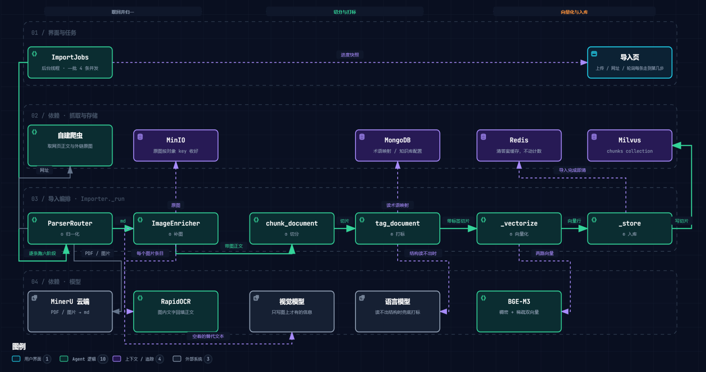
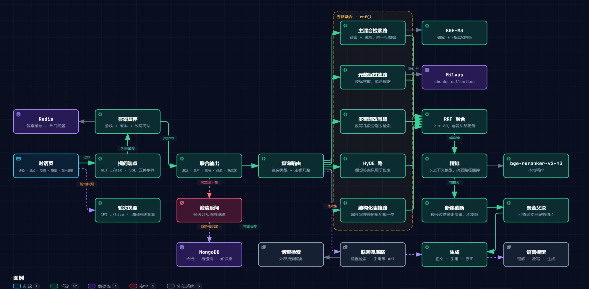

# RAGamer

**面向游戏攻略与资料的中文 RAG 助手。** 按游戏建库、用口语提问，系统先确认问的是哪款游戏、哪个版本，再检索并给出**带引用的回答**。

游戏资料散在 wiki 词条、攻略站图文、PDF 手册和截图里。通用大模型直接答这类问题会编：专有名词（「妖王」「心法」「根器」）它不认识，版本差异它分不清，图片里的数值它读不到。RAGamer 把这些来源统一收进来，用一套中文检索栈把它们变成可检索、可引用的语料，再把答案连出处一起交回去。

## 架构

两条链路各一张图。两张图在 [`docs/diagrams/`](docs/diagrams/) 下各有一份**同名 HTML**（`.png` 是静态导出、`.html` 可交互），带悬停高亮与明暗主题。

### 导入：四种来源，一个归一化点



md / txt / PDF / 图片 / 网页全部**先归一成 Markdown**（[ADR-0006](docs/adr/0006-md-as-universal-intermediate.md)），此后补图、切分、打标、向量化、入库只面对一种形态。新增一种来源只影响它自己那一个环节。

### 检索：六路召回，一次模型调用定路由



六路召回里五路进 RRF 融合 → 精排 → 按分数落差截断 → 聚合父块 → 带引用与图片生成；联网兜底路不进融合，单独成批。

## 技术亮点

### 一、中文检索栈：一个模型产出两路向量

- **BGE-M3 同时产出稠密与稀疏两路**，混合检索的两路因此必然同源，一次向量化搞定；稠密向量一律归一化，配 Milvus 的 IP 度量等价于余弦相似度。
- **精排用 bge-reranker-v2-m3，上下文上限显式配成 8192**。两个库自己给的 `max_length` 默认值都是 512，照默认值用就等于把「超长就 LLM 摘要压缩再重试」那条老路搬回来。
- 权重在第一次真的要用到时才加载，之后整个进程复用同一个实例；**两个模型都在本地推理，语料与问题不出机器**。

### 二、查询路由：判定不新增模型调用

- **路由标签是提问理解那一次调用的第四个输出字段**（游戏 / 版本 / 改写问法 / 查询类型），零额外调用、零新增节点——整个改造里性价比最高的一处。
- 六类问题到六路召回的映射是**数据不是代码**，可按知识库逐行覆盖；落盘时只写与默认不同的行，否则默认值以后就改不动了。
- 判不出类型就按事实型那一行走，**不另立一份「默认组合」**；跑不了的路（依赖没配）跳过但留一条 warning，不与「组合配错了」长得一样。

### 三、导入管道：单一归一化点，一批互不牵连

- **MediaWiki 站点走 `api.php` 拿 wikitext 原文**，不是渲染后的 HTML——下游切分器靠 `[[内链]]`／`Category:`／Infobox 认词条页，打标器靠它们读主体类型。走哪条路由页面自己声明（head 里的 RSD 与 `generator`）。
- **普通网页走 trafilatura**：导航、页脚、侧边栏丢掉，正文转 Markdown。
- **合规落在唯一一条出网路径上**：查 `robots.txt`、每主机 1 请求/秒、请求头标明身份。**重定向每一跳都重新过一遍**——跟着 `httpx` 一次跳到底会绕过这一层。没有关掉 robots 的开关。
- **原图另走一次请求，与抓页面同一套约束**；wiki 的缩略图地址取的是它上一层那份原图——缩略图宽度是站点按版面挑的（实测 18／60／130px），回显放大就糊。
- **一批最多 4 条并发**，并行的是「等网络」（MinerU 解析、抓网页、视觉摘要、打标）；本地重活在各自适配器里仍串行——CPU 机器上并发只是把同一块 CPU 切来切去，中间结果的内存还按并发数翻倍。
- **某一条失败不牵连其余**：逐条给 `source` / `stage` / `error`，整批都失败也是 200 不是 500；文档标识是「标题 + 版本」，一次提交里两条撞成同一个标识时后一条当场失败并点名跟谁撞了——两条都报成功而库里只剩一条，是这条链路上最难查的结果。

### 四、图内文字：二次 OCR 是必需项，不是兜底

- MinerU 不把图片区域里的文字 OCR 成正文，这是它的产品决策。**22 张真实截图实测，必须依赖二次 OCR 的比例是 100%**（56/56 个图片条目，两个后端完全一致）。
- 二次 OCR 用本地引擎（RapidOCR + PP-OCR 中文模型，模型随包带）。再走 MinerU 没意义——不识别图片区域正是问题本身。那批 22 张全部识别出文字，其中 MinerU 抽出 **0 字**的那张整页论坛帖截图，二次 OCR 拿回 521 字。
- **视觉摘要带上图前后各 100 字符原文**：没上下文它只能猜，而猜错的游戏名会混进语料——同一张燕云十六声的截图，两次分别被猜成《永劫无间》与《逆水寒手游》。提示词同时写死「只写图上才有、前后文字里没说过的信息」，也不让它自报家门。
- 有图注的图不调模型（作者写的说明比现补的一段准）；行内图标不下载也不调模型（判据是 MediaWiki 的缩略宽度标记，阈值 32px）。

### 五、图片地址不进正文

- 切分时 `` 只留 alt，**地址落到切片自己的 `image_urls` 字段**。
- 实测 `black_myth` 库 77.6% 的正文字符是地址、`yanyun16s` 是 55%；摘走之后同一份文档的切分结果从 40 片 22921 字降到 14 片 2623 字，而地址 127 处一个不少。
- **alt 留着**：它是这张图唯一的可检索文本，补图那一层的视觉摘要正写在这里。

### 六、数据建模：两个正交维度，版本并存

| 决策 | 结论 |
| --- | --- |
| 主体标签 | 拆成**主体类型**（文档级，「这是谁」）与**内容性质**（切片级，「这段回答什么问题」）两个独立字段（[ADR-0003](docs/adr/0003-two-orthogonal-tag-fields.md)） |
| 向量库分区 | 一个游戏一个 collection。收益是**生命周期**而非性能——「删库即释放」比条件删除干净（[ADR-0002](docs/adr/0002-one-collection-per-game.md)） |
| 版本语义 | 新版本作为新文档导入并与旧版本**并存**；过滤条件必须是「等于所选版本**或**未标注版本」（[ADR-0004](docs/adr/0004-versioned-content-coexists.md)） |

- 两轴拆开是因为它们不在同一个轴上：「角色」「地点」回答「讲的是什么」，「打法」「数值」回答「讲的是哪一面」。单字段会让「二郎神攻击力」同时落进两个类，分类互相打架。
- **父子块**：检索命中的是细粒度子块，交给生成的是其所属的聚合父块（回查同文档兄弟切片）。引用带**祖先标题路径**（「二郎神 › 打法 › 第二阶段」），不是一个光秃秃的文档名。
- 降级只发生在结构这一维：同一条 md 内部可以「前半按标题切、后半按语义边界切」并存。
- 版本过滤漏掉「或未标注版本」后半句，用户切到历史版本后会突然答不出世界观类问题——而这类静默失效极难定位。

### 七、检索质量：比名次、看落差、不硬凑

- **多路之间比名次不比分数**（RRF，`k=60`）。各路的分数是几套量纲，放在一起比大小等于让量纲决定谁进上下文；融合常数削弱头部名次的绝对优势，不是随手取的默认值。
- **截断按分数落差**（绝对 >0.3 或相对 >0.5），不是取前 K 条；上界是 `min(10, 候选数)`，候选本来就少时不凑数。候选池取上界 3 倍——池子不大于上界，断崖等于没生效。
- **向量化只调一次且文本去重**：各路要检索的文本合成一批送去向量化。分开调，各路问的就不是同一个问题了，而且中间没有任何一处会报错。
- **HyDE 那段假想答案是模型编的，只用于检索**，绝不进交给生成的资料——照它回答等于让模型照着自己编的东西说话。
- **引用与资料同批同序，编号不写进正文**。读的人手上是一份并排的来源清单，句末挂个数字既指不出是哪条、又铺满整段；模型硬标出范围外的编号会留一条 warning。
- **任一路失败不拖垮整体**，但所有选中的路都失败时照抛——报成「没找到资料」等于把一次故障说成了语料问题。
- **检索不到内容时明确回复，且不调模型**：没有资料可依据，让模型自由发挥只会得到一段编造的游戏攻略。

### 八、缓存与热门问题

- 键是**游戏 + 版本 + 改写后的问题**的精确匹配（sha1），**不做语义缓存**——多一层向量相似度就是多一层要标定的阈值。复用改写结果做归一化，改写稳定可复现因此是缓存能成立的前提。
- **缓存的是整份结果**：答案、引用来源、图片地址。只缓存文本的话，命中之后引用与图片就没了，而界面上看不出区别。
- **命中时逐字重放**，粒度与未命中那条路取齐。一次整段吐出去等于让「流式」在缓存路径上静默失效，而未命中时一个字一个字出来、命中时整段砸下来，命中恰恰是最常走的那条路。
- **顺带产出热门问题**：同一套 Redis 里按改写后的问题计数，命中与否都记，计数写在另一个根下——导入一次资料不会把「大家都在问什么」一起抹掉。
- **缓存连不上就降级**，作答照常。它是加速器而不是链路的一环，所以**不在启动自检里**。

### 九、约定是可执行的，不只是文档

- 三个外部存储、两个模型、缓存各自定义一个**协议**（`stores` / `vectors` / `caching` 的 `base`），实现类**只在组合根 `container` 构造一次**，没有任何模块级单例；业务层只认协议，`pymilvus` / `pymongo` / `minio` / `torch` 只允许出现在各自的适配器模块里。
- **测试零网络、零权重**：内存假件实现同一组协议，测试里整体替换。真连云端的那部分标了 `integration`，默认不跑。
- 配置**只有一个装载入口**（`config.py`），其余模块拿 `Settings` 对象用，不各自读环境变量。键名必须带 `RAGAMER_` 前缀，拼错的键启动时报错并给出最接近的那个，`.env` 里的 `${…}` 插值一律拒绝——静默生效比报错难查得多。
- 以上各条**由 `tests/test_conventions.py` 机械拦截**：约定不是靠自觉，是靠测试挡住。
- 规模：源码 ~16k 行、测试 ~19.5k 行（48 个测试文件，默认收集 1246 个用例）。测试比源码多，是这套约束能维持住的原因。

### 十、前端零构建，对话可续看

- **FastAPI + Jinja2 + htmx + Tailwind CDN**：没有 npm、没有打包产物、没有构建步骤（[ADR-0005](docs/adr/0005-htmx-frontend.md)）。依据是排障能力——htmx 出错时看到的是一行可读的 HTML 属性。
- **禁用 JavaScript 也能用**。每条写入路径都是普通 HTML 表单；导入进度退到 `noscript` 的 meta refresh，提问退到「整轮跑完再回整页」。
- htmx 只用在有一块结果区可以就地换掉的地方（导入就是）；改配置与删库走「提交 → 重定向 → 渲染」，否则刷新一下就把上一次的删除再提交一遍。
- **一句话问出去，回来的是 `status` → `citations` → 若干 `delta` → `done`**：`status` 让「提问到第一个字」那一段不干等，`citations` 比正文早得多——引用在检索那一步就定下来了。
- **切走、刷新只停转发，那一轮照跑完、照落库**，回来问一次快照（`GET /api/chat/sessions/{id}/live`）就接着显示，连你问的那句一起。要真收手得点「停止」。这与导入页看进度是同一个姿势：后台跑 + 轮询快照。
- **会话落在 MongoDB**，刷新页面、换台机器打开历史都在。存的是**用户的原话**，改写只给检索用；**历史只进提问理解不进生成**——把上一轮的答案也塞进提示词，模型就有了一处引用不到的来源可以顺着编。
- **澄清反问落在同一条流上**：候选**只从语料里取**，绝不由模型生成。判不准是哪款游戏、哪个版本就反问，而不是猜一个然后照它检索——猜出来的游戏名只会查空，而且不报错。

## 技术栈

| 层 | 选型 | 说明 |
| --- | --- | --- |
| 语言 / 包管理 | Python 3.12 + [uv](https://docs.astral.sh/uv/) | 依赖分组，模型与 OCR 放可选组 |
| HTTP / 页面 | FastAPI + Jinja2 + htmx | 服务端渲染，零构建（[ADR-0005](docs/adr/0005-htmx-frontend.md)） |
| 向量检索 | Milvus + BGE-M3 | 稠密 + 稀疏同一批数据融合 |
| 精排 | bge-reranker-v2-m3 | 长上下文，本地推理 |
| 会话 / 元数据 | MongoDB | 会话、知识库配置、术语映射 |
| 对象存储 | MinIO | 原图（对象 key 里带来源字节摘要） |
| 缓存 | Redis | 答案缓存 + 热门问题；可选，连不上只降级 |
| PDF / 图片解析 | MinerU 云端 API | 预签名地址上传下载，凭据不外流 |
| 二次 OCR | RapidOCR + PP-OCR 中文模型 | 本地 CPU，模型随包带 |
| 网页抓取 | trafilatura + MediaWiki API | 自建爬虫，robots + 限频 |
| 联网兜底 | [博查](https://open.bochaai.com/) Web Search | 换别家是加一个适配器 |
| 语言 / 视觉模型 | OpenAI 兼容接口 | 自己发请求，不引 SDK，便于打真实代码路径 |
| 测试 / Lint | pytest + ruff | CI 在每次 push 与 PR 上跑 |

## 快速开始

需要 [uv](https://docs.astral.sh/uv/)（Python 3.12 由 uv 自己装，不必预装），以及 Milvus、MongoDB、MinIO 三个服务。

```bash
uv sync                          # 建虚拟环境、装依赖
cp .env.example .env             # 按注释把值填成自己的
uv run ragamer                   # 启动自检：配置合格、Milvus/Mongo/MinIO 都连得上才通过
uv run ragamer-web               # 起界面：浏览器打开 http://127.0.0.1:8000
```

退出码 `0` 通过、`2` 配置有问题、`3` 存储连不上——远端不可达时在 `RAGAMER_STORE_TIMEOUT_SECONDS` 秒内失败，错误信息里点名是哪个服务、哪个地址。

两个可选依赖组按需装：

```bash
uv sync --extra models           # 真实向量化与精排模型（torch + transformers，首次下载几个 G）
uv sync --extra ocr              # 二次 OCR；导入 PDF 与图片前必须装，缺了图片里的文字一张也拿不到
```

核心链路与全部默认测试都用确定性的哈希假件跑，装上面两组只为跑 `uv run pytest -m integration`。

## 常用命令

| 命令 | 作用 |
| --- | --- |
| `uv run ragamer` | 启动自检：配置合格、Milvus/Mongo/MinIO 都连得上才通过 |
| `uv run ragamer-web` | 起界面与后端（先跑一遍同样的自检，通了才起；默认 `127.0.0.1:8000`） |
| `uv run pytest` | 跑测试（集成测试默认不跑，加 `-m integration` 才跑） |
| `uv run ruff check .` | 跑 lint |
| `uv run ruff format .` | 格式化 |

## 目录

```
src/ragamer/           应用代码（config 配置装载、logging 日志、llm 语言模型适配器、sources 归一化、
                       mineru PDF 与图片的云端解析、enriching 补图、ocr 二次 OCR 引擎、lazy 懒加载、
                       crawl 网页抓取、wikitext 维基语法转 Markdown、chunking 切分器、tagging 打标、
                       importing 导入编排器、knowledge 知识库元数据、query 提问理解、
                       expanding 查询扩展、routing 查询路由、websearch 联网兜底、
                       retrieval 多路召回与融合、answering 生成与引用、conversations 会话与流式、
                       clarifying 澄清反问、caching 答案缓存与热门问题、api HTTP 端点、
                       web 页面、app 应用装配与起服务、container 组合根、__main__ 启动自检）
src/ragamer/stores/    存储适配器：base 协议与共享类型、chunks Milvus、documents Mongo、objects MinIO、memory 内存假件
src/ragamer/vectors/   向量化与精排：base 协议与共享类型、bge 真实模型、fake 确定性假件
src/ragamer/caching/   答案缓存：base 键与协议、redis 真实实现、memory 内存假件、answer 读取侧入口
src/ragamer/web/       页面与模板（templates/ 跟着包走，装成 wheel 也在）
tests/                 测试：行为测试 + 结构约束 + 集成测试
tools/                 一次性脚本：量图内文字提取率等实验（不进包，需真实凭据与截图）
docs/                  架构文档、ADR、实验记录、实现笔记
```

## 文档

| 文档 | 内容 |
| --- | --- |
| [`docs/ARCHITECTURE.md`](docs/ARCHITECTURE.md) | 架构与设计：统一管道、数据层、检索链路、必须继承的坑、明确不继承的反向清单 |
| [`CONTEXT.md`](CONTEXT.md) | 领域术语表（知识库、切片、主体类型、内容性质、断崖截断……） |
| [`docs/adr/`](docs/adr/) | 不可逆决策：业务层重写、一游戏一 collection、两正交标签、版本并存、htmx、归一为 md |
| [`docs/experiments/`](docs/experiments/) | 实测记录：MinerU 图内文字提取率、二次 OCR 逐张对照 |
| [`docs/IMPLEMENTATION-NOTES.md`](docs/IMPLEMENTATION-NOTES.md) | 实现笔记：逐模块的实现细节、实测数字与踩过的坑 |

## 已知限制

- **网址导入端点不拦内网地址**。它收的是用户给的网址，多用户部署时是一个 SSRF 面（`http://169.254.169.254/…` 这类）。本项目现在是自己给自己导资料的单机工具，上多用户之前必须补上——拦内网要连 DNS 解析一起做，否则域名解析到内网就绕过去了。
- **导入任务状态只在服务进程内存里**，重启就没了。跑着的导入本来也活不过重启，所以不留半截账。
- **Python 3.12 与三个外部存储是硬依赖**，没有单机模式。
- **评测是独立阶段，尚未落地**。所有阈值、权重、`k`、`chunk_size` 目前都是经验值——任何调参都应先有评测集，否则只是把一个猜测换成另一个猜测。
