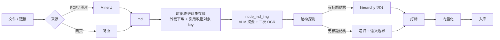
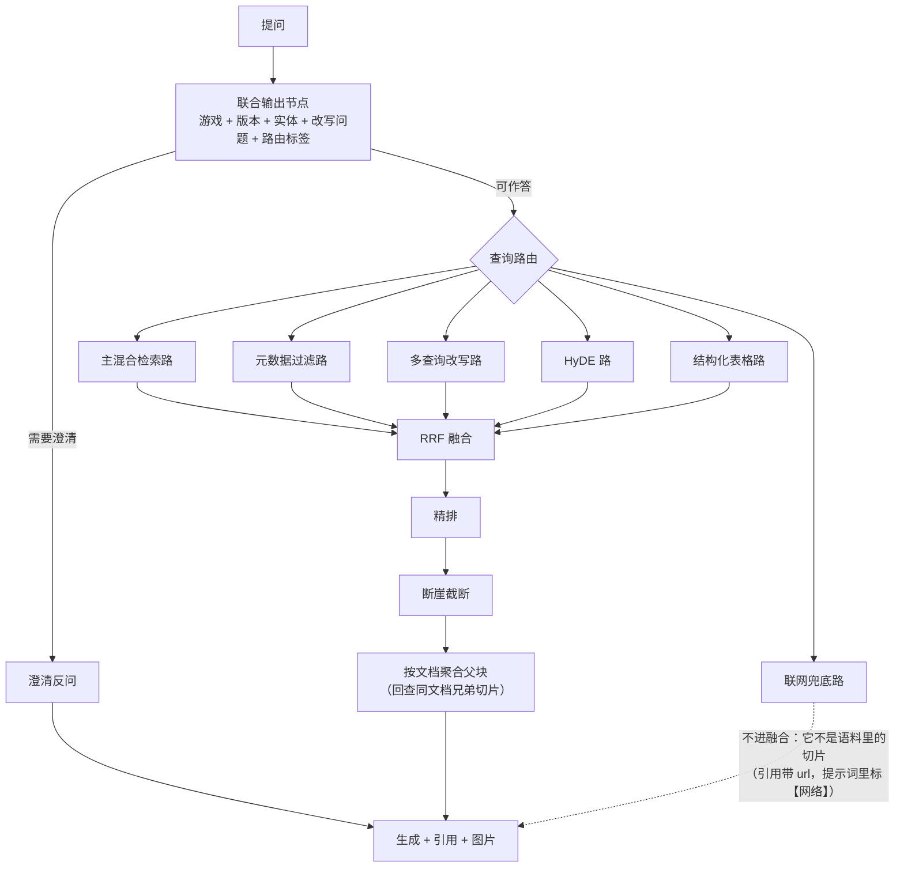

# RAGamer · 架构与设计

面向游戏攻略与资料的中文 RAG 助手。用户按游戏建库、用口语提问，系统先确认问的是哪款游戏、哪个版本，再检索并生成带引用的回答。

**这份文档是给人和 agent 读的实施规格**：它讲清每一处设计的取舍。术语定义见 [`../CONTEXT.md`](../CONTEXT.md)，不可逆决策见 [`adr/`](./adr/)。

**已定的边界**：可以取舍但不能做成玩具。参照 [RAGFlow](https://github.com/infiniflow/ragflow) 的**设计思路**，不参照它的代码规模（它的前端实测 1730 文件 / 20 万行业务代码，见 [ADR-0005](./adr/0005-htmx-frontend.md)）。

**既有实现**：游戏 RAG 领域没有可直接复用的框架 —— 公开项目里除 `rimulu030/gamewiki`（308★）外均在 45★ 以下，绝大多数是课程级项目。因此本项目自建，可借鉴的具体项目列在第九节。

---

## 一、统一管道

全部输入先归一为 Markdown，之后所有环节只面对 md 一种形态 —— 理由见 [ADR-0006](./adr/0006-md-as-universal-intermediate.md)。



### 1.1 各来源的处理

| 来源 | 处理 |
|---|---|
| **PDF** | MinerU 云端 API，`model_version: vlm` |
| **图片**（PNG/JPG/…） | MinerU 会先转成单页 PDF 再走同一条链路 |
| **网页链接** | 自建爬虫 → md，两条路（见 1.5），**原图另行取回**。**这是本管道唯一新增的环节** |
| **md / txt** | 直接进入 `node_md_img`，正文里的外链图同样取回 |

**原图在归一化那一层收拢，三条来源一样**（`ragamer.sources.fetch_images` →
`publish_assets`）：网页与 md 正文里是外链的，先下载成附件；MinerU 的附件本来就在手上。
**wiki 那种缩略图地址取的是它上一层那份原图**（`original_ref`）：缩略图的宽度是站点按版面
挑的（实测 18／60／130px），回显出来放大就糊；原图取不到时退回缩略图地址。
两步之后正文里的引用一律是对象 key，补图与展示都按 key 取。**行内图标不下载**
（判据是 MediaWiki 缩略图地址里的显示宽度，`ICON_MAX_PX = 32`）：它不值得占一份对象存储，
也不值得为它调一次视觉模型；它是版面装饰，答案里也不显示。
**取不到原图的那几种（图标、相对路径、下载失败的）没有对象 key，不进 `image_urls`**：
回显是拿地址去对象存储取的，带进答案只会在页面上多一条「没有这张图」。

### 1.2 🔴 MinerU 不提取图片区域里的文字

这是导入链路最容易踩的坑，**官方明确表态的产品决策，三年未变**（issue #1111 / #1185 closed as not planned / #3629，maintainer 原话：*"我们不会直接将图片中的文本 ocr 成字符，因为这样会丢失文本之间的结构关系"*）。

源码层面：`get_res_list_from_layout_res()` 只把 `TEXT_REGION_LABELS` 送进 OCR 队列，`image` 和 `chart` **都不在其中**。`content_list.json` 里 image 条目的 schema 是 `{type, img_path, image_caption, bbox, page_idx}` —— **没有 `text` 字段**。

**转机**：VLM 后端的 `image_analysis` 默认开启，而本项目用的就是 `model_version: vlm`。

> ⚠️ **2026-09-13 实测：这条转机在云端没有生效。** 22 张真实截图上，云端 `vlm` 与 `pipeline`
> 的结果逐张完全一致，图内文字一个字都没出来；产物里没有下面说的 `<details>` 折叠块，
> `vlm` 只是给 image 条目多了一个 `content` 字段（实测全空串）。
> 结论与逐张明细见 [`experiments/mineru-ocr.md`](./experiments/mineru-ocr.md)。
> 下面那三处「必须处理」里的第 1 处，在本批素材上没有对象（但要防着别的输入形态真产出它）。

要是哪天它生效了（或换自建 MinerU），下面这三处仍然得处理：

1. **结果塞在 HTML 折叠块里**，不在正文 —— 切分/清洗若不处理 HTML 就会静默丢失：
   ```html
   
   <details>
   <summary>text_image</summary>
   <图内文字>
   </details>
   ```
   > **T12 已按防御性处理做掉**（`ragamer.enriching.unfold`）：标记与 `text_image`
   > 那句标签去掉、块里的文字留下。**只对带条目级结构的产物生效**——md／网页里那对
   > 标记可能真的在讲这个元素，拆掉就是在改用户写的东西。本批素材里没有对象。
2. **小图会被跳过**：`IMAGE_ANALYSIS_MIN_BLOCK_SIZE = 0.1` + `MIN_BLOCK_AREA = 0.01`，宽高都 ≤10% 页面且面积 ≤1% 的小图不分析
3. **云端 API 不暴露 `image_analysis` 参数** —— 只能选 `pipeline` / `vlm` / `MinerU-HTML`。云端跑 vlm 时是否开启，属于未确证项

### 1.3 二次 OCR 回填（方案四）

**独立上传的攻略截图**是最坏的情况：它没有周边正文，图内文字就是全部信息。做法是在 `node_md_img` 里对 MinerU 产物做二次处理：

```
图片 → [VLM 摘要]  ─┐
     → [二次 OCR]  ─┴→ 统一写进正文 → 图片地址摘到切片自己的字段上
```

对 `content_list.json` 里 `type == "image"` 的条目，用其 `img_path` 取出图片做 OCR，把文字回填到 md 正文中图片引用的**之后**（图片本身仍保留，供答案展示）。

**摘要带上图前后的原文**（T27 / #29，各 100 字符）：给上下文是为了让它认出「这是谁、这是哪一处」。没上下文时它只能猜，而**猜错的游戏名会混进语料**——实测同一张燕云十六声的截图，两次分别被猜成《永劫无间》与《逆水寒手游》（这也是提示词一度禁止它交代出处的原因）。提示词同时写死「只写图上才有、前后文字里没说过的信息」：不这么写，模型会把周围正文复述一遍，那句摘要进了切片只是把同一段话算两遍分。**上下文里别的图片地址先摘掉**——wiki 页面的图是成片的，不摘的话那段上下文有一大半是地址，等于把「地址混进正文」那件事从提示词这条路放回来；窗口是硬切的 100 字符，会从中间切断邻居的地址，所以窗口必须在**摘完地址**的正文上取，不是在原文上取完再摘（半截地址认不出来，会原样留在上下文里）。

**也试过让摘要自报家门（「说得出它是谁就点出来」），实测后否掉了**：同一段上下文里并列着九转金丹、太乙紫金丹、碧藕金丹三个名字，而图是碧藕金丹，模型报了「九转金丹」——有候选可挑就一定会挑一个。检索上也不赚（正文与图在同一片切片里，那个名字本来就检索得到）。所以只让它**认**图，不让它**报**名。

**地址最终不进正文**（T26 / #28）：切分时 `` 只留 alt，地址进切片自己的 `image_urls` 字段，答案按它回显原图。留在正文里的代价实测过——`black_myth` 库里 77.6% 的正文字符是地址，`yanyun16s` 是 55%；而且地址比切片上限还长时会被切分器从中间切开，存下一条取不到原图的坏地址。**alt 必须留着**：它是这张图唯一的可检索文本（VLM 摘要正写在这里）。

**进 `image_urls` 的只有对象 key**：回显是拿地址去 `GET /images/{key}` 取的，而正文里的引用不都取得到原图（行内图标不下载、相对路径与下载失败的原样留着）。那些地址带进字段就是在答案里多一条取不到的死图——页面上只报一句「没有这张图」，原因早在导入时说过。切分与读答案两处都按 `is_image_key` 过一道；读侧那道是兜底，改之前导进去的库里还留着这样的旧地址，不必为了看图重导一遍。

**这与原项目 `node_md_img` 的设计是同一件事的延伸**：那个节点本来就在做"给图片补一段可检索的文本"（把 VLM 摘要塞进 alt 文本），二次 OCR 只是给它补上另一路输入。

> **上生产前必须做的实验**：拿 20 张真实攻略截图（长图 / Excel 截图 / wiki 截图各若干），分别用 `pipeline` 和 `vlm` 各跑一遍，统计 `type == "image"` 的条目中「有 `img_path` 但无 `content`」的比例 —— **这个比例就是必须依赖二次 OCR 的比例**。这比任何文档调研都准。
>
> **2026-09-13 已跑（T10 / #11）：比例 = 100%（56 / 56 个图片条目，pipeline 与 vlm 逐张完全一致）。** 22 张真实截图、44 次解析全部成功，无一张图内文字进得了正文。**同时要看清损失面**：22 张里 8 张几乎整页被判成一个图片区域（`12-30-06` 是整张论坛帖截图，抽出 0 字），11 张图文混排，3 张纯文字截图抽得干净——所以问题不在文字识别，而在**整页被当成一张图**之后内容就再也不会进库。完整结论、逐张明细与这一层量法见 [`experiments/mineru-ocr.md`](./experiments/mineru-ocr.md)，重跑用 `uv run python tools/mineru_ocr_experiment.py <截图目录> --out …`。
>
> 这一跑同时**推翻了 §1.2 的「转机」**：云端 vlm 的产物里根本没有 `<details>` 折叠块，它给 image 条目多一个 `content` 字段（实测全空串）。也就是说 `image_analysis` 在云端没生效——§1.2 第三点列的未确证项，答案是「没开」。**T12 的范围因此是：必须做，且覆盖每一个 image 条目，不挑大小图。**

⚠️ 另一个未确证项：`MAX_PAGE_ASPECT_RATIO = 10.0` + 200 DPI 重采样对**超长攻略图**的影响，无官方说明，需实测。

**T12（#13）已落地**，实现是 `ragamer.enriching`（补图）与 `ragamer.ocr`（引擎）：

- **引擎换成本地的**（RapidOCR，PP-OCR 中文模型，随包带、离线跑）。再走 MinerU 没有意义——
  它不识别图片区域正是问题本身。云端接口在「一份资料几十张图」这个量级上又慢又贵。
  引擎在可选的 `ocr` 组里，**导入 PDF 与图片必须装上**：缺了它图片里的文字一张也拿不到，
  正是这一层要防的那种静默丢失，所以它让那份资料带着原因失败，不是一张一张跳过。
- **范围照上面的实验**：每个 `type == "image"` 的条目都做，不挑大小图；文字插在正文里
  该图引用**所在那一行的末尾**——不是紧贴右括号，表格内嵌的图引用在行当中，贴着插会
  把那句话拦腰截断。原图引用本身不动，答案里仍能展示。
- **条目自带 `text` / `content` 时不再识别一遍**，直接用它的。
- **视觉摘要**是另一件事、另一个模型（`RAGAMER_VISION_*` 那组，只收多模态模型），
  写进**空着的**替代文本；已有 alt 的不覆盖也不调用。整组不配就只做二次 OCR。
- **实测**（2026-09-13，T10 那同一批 22 张截图，CPU）：22 张全部识别出文字
  （18–628 字/张，中位数 259）。最要紧的一处是 `12-30-06`——MinerU 从它身上抽出
  **0 字**，二次 OCR 拿回 521 字，正是「整页一张大图」那一档。单张 4.4–11.7 秒，
  一份几十张图的资料要按分钟计。出字量与逐张对照见
  [`experiments/second-pass-ocr.md`](./experiments/second-pass-ocr.md)，
  重跑用 `uv run python tools/second_pass_ocr.py <截图目录> --out …`。
- **不设阈值配置**：实验定下的是范围，没有定下任何识别阈值，所以照引擎的默认值走。
- **不做识别前处理**（放大、裁剪、二值化）：同一轮实验里，MinerU 本来就抽得干净的那几张
  纯文字截图，二次 OCR 给的字数基本相同——文字识别本身没问题，问题只在「整页被判成
  一张图」，换个引擎就够。

### 1.4 结构探测与降级

降级阶梯内移为"这条 md 有没有可用的标题结构"：

| 判定 | 切分策略 |
|---|---|
| 标题密度高、有 Infobox / 表格块 | `hierarchy` 模式，保留完整祖先标题路径 |
| 标题少或无 | 递归切分 + 语义边界检测 |

判定信号（按权重）：Markdown 标题行数占正文行数比 › 是否有表格块 › 是否有 MediaWiki 特征（`[[链接]]` / `Category:` / `{{模板}}`）› 平均段落长度。

**同一条 md 内部允许两种切法并存。**

### 1.5 网页的两条路

| 站点 | 走法 | 为什么 |
|---|---|---|
| **MediaWiki 类**（Fandom / wiki.gg / 官方 wiki） | 开放接口 `api.php` 取 **wikitext 原文**，转 Markdown | 下游读的正是 wiki 标记：切分器靠 `[[内链]]`／`Category:`／`{{模板}}` 认词条页（§1.4），打标器靠 `[[Category:角色]]` 与 Infobox 的 `| 类型 = 角色` 读主体类型（§2.3）。先渲染成 HTML 再转 Markdown 会把这两处信号一起洗掉，**而且不报错** |
| **普通网页** | 正文抽取（trafilatura），导航／页脚／侧边栏丢掉 | 这条路没有任何结构可读，能做的就是把噪声去掉、把正文留下 |

走哪条路由**站点自己说了算**：页面 head 里有 MediaWiki 的 RSD（`rel="EditURI"`）或
`generator` 声明就走接口，否则按普通网页抽。转出来的都是**同一种 md**，此后与本地文件
再无区别。

转换时有一处分界必须拿捏：**该像 Markdown 的转成 Markdown，该留给下游的原样留着**。
`[[Category:…]]` 与 `{{模板块}}` 属后者——它们看着像没洗干净的标记，实则是打标与切分
唯一的输入。同理，表格转 GFM 时格里的竖线要转义（`\|`）而不是原样留着：`{{lang|zh|…}}`
这类模板在格子里很常见，不转义就会多切出一列，切分器按列做的长文本列降级随之全部错位。

**合规落在出网的唯一一处**：先读该主机的 `robots.txt`、两次请求之间留足间隔、请求头里
标明身份。**不设关掉 robots 的开关**——把开关做出来，它就一定会被用来图快。
**重定向逐跳复查**：`robots.txt` 只写了入口那个地址，跟着 HTTP 客户端一次跳到底会绕过去。
失败分三类（站点不可达／页面不存在／被拒绝访问），robots 挡下的算最后一类的子类。

⚠️ **不拦内网地址**：导入端点收的是用户给的网址，多用户部署时这是一个 SSRF 面。
现在是单机工具，而拦内网要连 DNS 解析一起做（否则域名解析到内网就绕过去了），
半套防护比没有更容易让人放心。上多用户之前必须补上。

---

## 二、数据层

### 2.1 分区与命名空间

**一个游戏知识库 = 一个 collection**（[ADR-0002](./adr/0002-one-collection-per-game.md)）。这与 Qdrant 官方"每用户一 collection 是反模式"的建议相反，但本项目规模（若干款游戏）远低于 Milvus 的 65536 collection 上限，且 Dify 在 Milvus 上就是 per-dataset collection。

**与原项目共存**：共享 Milvus / MinIO / Mongo 实例，但**用 Milvus 的 database 隔离**（上限 64），而不是 collection 名前缀 —— 字符串前缀更容易撞车。MinIO 换桶名、Mongo 换库名同理。原项目须保持可运行。

### 2.2 `chunks` collection schema

| 字段 | 类型 | 说明 |
|---|---|---|
| `chunk_id` | INT64 | 主键。**由导入侧分配**，不用服务端自增 —— 重导一份文档要能覆盖同一批 id |
| `content` | VARCHAR | 正文。图片的 VLM 摘要与二次 OCR 文字都在这里。**参与向量化** |
| `content_meta` | VARCHAR | 不参与向量化的附加文本（表格里的长文本列；Infobox 原始字段见 2.5 的说明）。随结果返回但不打分 |
| `image_urls` | ARRAY\<VARCHAR\> | 这片正文里出现过、**且取得到原图**的**图片地址**（对象 key），见 §1.3。**不在 `content` 里**——切分时就把地址摘走了，正文里留的是替代文本。既不进向量也不交给生成，唯一的用处是答案里显示原图 |
| `ancestor_path` | VARCHAR | **祖先标题路径**，如 `二郎神 › 打法 › 第二阶段` |
| `chunk_index` | INT64 | 切片在源文档中的顺序，从 0 起 |
| `subject_name` | VARCHAR | **主体名**，文档级 |
| `subject_type` | ARRAY\<VARCHAR\> | **主体类型**，文档级，7 类 |
| `content_nature` | ARRAY\<VARCHAR\> | **内容性质**，切片级，5 类 |
| `game_terms` | ARRAY\<VARCHAR\> | 该游戏的**游戏术语**标签 |
| `game_id` | VARCHAR | **逃生舱**：为将来合并为共享 collection 预留 |
| `version` | VARCHAR | 版本。**空串表示未标注版本** |
| `doc_title` | VARCHAR | 来源文档标题 |
| `source_url` | VARCHAR | **来源地址**。网页导入才有，本地文件是空串。答案是带引用给的，引用的落点就是它 |
| `chunk_type` | VARCHAR | `text` / `table` / `image`。**v1 只产出前两种**：补图是把图内文字写回正文（§1.3），不另外产出图片切片，`image` 这一档留作预留 |
| `content_hash` | VARCHAR | 变更检测，为增量导入预留 |
| `dense_vector` | FLOAT_VECTOR(1024) | BGE-M3 稠密 |
| `sparse_vector` | SPARSE_FLOAT_VECTOR | BGE-M3 稀疏 |

**两个标签字段与 `image_urls` 都是 ARRAY** —— 因为主体类型不互斥（"二郎神的技能"同时属于角色和技能），一片正文里的图片也不止一张。过滤用 `ARRAY_CONTAINS`。

**显式声明全部字段，关闭动态字段** —— 不是随手写的，理由见第六节「必须继承的坑」第 1 条。建表只在表**不存在**时发生，所以加字段之后老库要重新导入：`ensure_collection` 会比对已有表的结构，缺字段时当场报出来，而不是让服务端回一句「字段不存在」。

**`doc_title` 与 `version` 上建倒排索引** —— 聚合父块要靠它们回查兄弟切片（见 2.5）。**schema 里没有 `parent_id`**，理由同样在 2.5。

**`(doc_title, version)` 是文档标识，也是重导替换的范围** —— 所以同一次提交里它必须唯一：
两条来源（两个文件、两个网址、或一样一个）落成同一个标识时，后写的那条会把前一条整批删掉，
而两条结果都报成功。导入侧因此在一批内认领这个标识，撞上了就让后一条带着原因失败，
并且**把这一条挡在「重试」之外**——单独重试它，它就成了那一批里唯一的一条。
同一份资料的另一个版本不受影响 —— `version` 不同就是另一个文档（[ADR-0004](./adr/0004-versioned-content-coexists.md)）。

### 2.3 标签体系

**主体类型（7 类，文档级）**：`character` 角色/怪物/BOSS/组织势力 · `item` 物品/装备/道具/素材 · `place` 地图/场景/关卡 · `quest` 任务/副本/活动 · `skill` 技能/法术/招式/心法 · `background` 世界观/剧情/设定 · `system` 机制/规则/玩法

**内容性质（5 类，切片级）**：`intro` 是什么/是谁 · `where` 在哪/怎么获得/掉落 · `stats` 数值属性 · `guide` 怎么打/流程步骤 · `review` 好不好/哪个强

**一级词表全局统一，每个游戏建库时勾选启用哪些类。** 这样边缘类目无需争论 —— 燕云想留 `faction` 就留，黑神话直接不启用。用户自定义库不配置时**默认全开**：标签会稀疏但不会漏，是安全的降级路径。

**标签的生产有两条路，结构优先、LLM 兜底**：

| 标签 | 有结构时 | 无结构时 |
|---|---|---|
| `subject_name` / `subject_type` | 读 MediaWiki Category / Infobox 类型 | **LLM 读该文档前若干切片总结，回写全文档** |
| `content_nature` | 按该切片的标题归一 | **LLM 逐切片判断**（带上切片在文档中的位置作为弱上下文） |

🔴 **`content_nature` 绝不能文档级统一** —— 「背景故事」和「打法」在同一页面里，硬统一就废了。这是它和 `subject_type` 粒度不同的原因（[ADR-0003](./adr/0003-two-orthogonal-tag-fields.md)）。

**游戏术语**（"妖王"、"心法"）通过**术语映射**归入主体类型，映射表存 MongoDB、GUI 可编辑。用户自定义游戏未配映射时走 LLM 自动归一。

### 2.4 版本语义

**新版本作为新文档导入并与旧版本并存**，不替换（[ADR-0004](./adr/0004-versioned-content-coexists.md)）。

检索过滤条件**必须**是：

```
version == 所选版本  OR  version == ""
                       ↑ 漏掉这一条，用户切到历史版本后
                         世界观类问题会突然全部答不出
```

GUI 里用户可手动选版本，每条答案带版本徽章。

### 2.5 切分

**`hierarchy` 模式**（学自 RAGFlow 新版 pipeline 的 `TitleChunker`）：构建标题树，**每个切片携带完整祖先标题路径**。官方原话是*"每个块即使没有上下文也能通过其结构位置来识别"* —— 正对游戏 wiki 词条页（"获取方式""掉落""配队"这些小节独立且结构重要）。

> 对比原项目：只有一层 `parent_title`。这是本设计相对原项目最直接的一处增强。

**表格原子化**：

| 情况 | 做法 |
|---|---|
| Markdown 表格 | 整表一块，或按行组切且**每块重复表头** |
| 长文本列 | **降级进 `content_meta`，不进 `content`** |
| Infobox / 模板块 | 原子化，不切。整块留在 `content`，与表格同标 `chunk_type=table` |

🔴 **长文本列不进正文**这条不是优化而是必须：RAGFlow 的 Table 模板没有任何 token 上限，超长行会在 embedding 阶段被 `truncate(c, mdl.max_length - 10)` **静默截断** —— 内容永久丢失且无任何报错。把"说明"这类长列设成 `content_meta`（见 2.2）可以规避：它随结果返回，但不参与向量化，也就没有截断这回事。

⚠️ **Infobox 暂不进 `content_meta`**（与 2.2 括号里的那半句有出入，以这里为准）：模板块整块留在正文才检索得回来，整块挪进 `content_meta` 会让这一片正文变空。代价是**超长 Infobox 仍可能被嵌入截断** —— 模板块不受 `max_chars` 约束，切开就不是 Infobox 了。等真实语料里出现超长 Infobox，按它的样子定降级规则，别先拍一个阈值。

**父子块**：检索命中细粒度子块，交给生成的是**该主体在该文档的聚合父块**。用户问"二郎神怎么打"时，LLM 拿到整页 —— 包括"掉落"，所以追问"掉什么"不需要重新检索。

🔴 **聚合父块是查出来的，不单独入库。** 一个文档对应一个主体（`subject_name` / `subject_type` 文档级回写），所以"该主体在该文档的聚合父块"就是**该文档的全部切片**：命中并截断之后，按 `doc_title` 回查同文档的兄弟切片、按 `chunk_index` 升序拼接即可。

不另存父块表、不在 schema 里放 `parent_id`，理由是**父块不能有第二个真相来源**。一旦父块是独立存储的，重导一份文档就必须记得同步更新它 —— 漏掉就是静默失效，和原项目对象名前缀不一致导致"清旧图"失效是同一类事故。查出来的父块与子块永远同源：不需要同步，删库时也不会留下孤儿父块。

四条附带约束：

- **聚合发生在断崖截断之后**，否则会为即将被丢弃的切片白白拼一遍父块
- **回查必须带同一个版本过滤**（`version == 所选版本 OR version == ""`），否则会把不同版本的切片拼进同一个父块
- 超长文档按命中切片所在的 `ancestor_path` 收敛到该小节，不把整页喂进去
- 收敛之后**仍然超长**的（整篇只有一节，或者切片根本没有祖先标题路径），只留命中那一条并留痕 —— 上下文预算是硬约束，宁可不带上下文也不整页喂进去；这一情形多半说明切分没切出结构，是数据侧该修的事

---

## 三、检索链路



### 3.1 查询路由：零额外调用

**路由判定合并进已有的联合输出节点。** 原项目的 `node_item_name_confirm` 已经做了一次 LLM 联合输出（同时吐 `item_names` + `rewritten_query`）—— 把"本次走哪几路"作为第三个输出字段加进去，**是零额外调用、零新增节点**，只改 prompt 和输出 schema。

这是整个改造里性价比最高的一处：**没有新增任何 LLM 调用**，只是把一个已有调用的输出从 2 个字段扩到 3 个。

**默认路由表**（GUI 可覆盖）：

| 查询类型 | 走哪几路 | 例 |
|---|---|---|
| 事实型 | 主检索 + 元数据过滤 | "二郎神血量多少" |
| 攻略型 | 主检索 + 多查询改写 + 元数据过滤 | "二郎神怎么打" |
| 对比型 | 多查询改写 + 主检索 | "A 和 B 哪个强" |
| 模糊/口语型 | + HyDE | "那个很难的 BOSS 怎么过" |
| 时效型 | + 联网 | "这版本改了什么" |
| 表格型 | 结构化表格路 | "寒江雪的属性" |

**落地情况**（T17）：路由判定在 `ragamer.query` 的联合输出节点里，作为第四个字段（游戏、版本、改写问法之外）——**调用次数不变**。路由表在 `ragamer.routing`，六类与六路都是代码里的词表，表只负责把两者连起来。

与上表的三处出入，都是有意的：

- **表格型补上主检索**。两者不互斥：属性写在正文里而不是表格里是常事，只留表格路会让这一类问题一条候选都取不到。
- **「+ HyDE」「+ 联网」展开成「事实型那一组再加一条」**。上表这两行没有另给基础组合，只有这一个读法讲得通。
- **判不出类型时按事实型那一行走**，不另立一份默认组合——另立的那份与表里的一行迟早会分岔，而分岔之后「界面改了配置」与「判不出时走的还是老一套」在日志里看不出来。

路由表可由知识库元数据的 `route_table` 逐行覆盖（只覆盖写了的那几行；落盘时也只写与默认不同的行，否则默认值以后就改不动了）。配置写坏了当场报错，不静默按默认值跑。

六条路现在**全部接上了**（T18 补齐了多查询改写、HyDE、结构化表格路、联网兜底）。选中了跑不了的那条会留一条 warning 再跳过——「依赖没配」（没给语言模型、没配检索服务）与「还没实现」都算跑不了，静默跳过会让它们与「组合配错了」在日志里长得一模一样；一条都不剩时退回主检索路。

**联网那一路不参与融合。** 外部结果不是语料里的切片：没有父块可回查，也不该被当成语料参与精排与断崖。它单独成一批交给生成，**引用上带 `url`，提示词里带【网络】前缀**——「结果与本地语料区分标注」说的就是这件事。这是「兜底」该有的样子：本地查得到就轮不到它，本地不够时它补上，而读的人知道这是网上搜来的。

**HyDE 那段假想答案是模型编的，只用于检索**，绝不进交给生成的资料——照它回答等于让模型照着自己编的东西说话，而那样出来的答案与真答案长得一模一样。

**任一路失败不拖垮整体**：某一路挂了就记下来，用其余路的候选继续作答（多查询改写与 HyDE 要调模型、联网要发外部请求，各自都会单独失败）。但**所有选中的路都失败**时照抛——那不是「某一路的问题」，报成「知识库里没有找到相关资料」等于把一次故障说成了语料问题。

**元数据过滤路**按主体类型、内容性质、版本直接取候选，是**单路稠密检索**：它要的是「按标签取」，再叠一路稀疏会把标签之外的近义内容也捞进来，正好抵消过滤。内容性质由查询类型推出来（事实型/表格型 → 数值、攻略型 → 打法流程、对比型 → 评价推荐；模糊型与时效型不收窄，这两类问的恰恰是「说不清问的是哪一类」）；主体类型默认留空不限——判它要多一次模型调用或者一次术语扫描，而这一条正是本处「零额外调用」要守的。

### 3.2 两处术语必须分清

- **混合检索** = 稠密 + 稀疏，**同一批数据**上的两路向量融合。这是**一路内部**的机制（原项目权重 `(0.8, 0.2)`，`norm_score=True`）
- **多路召回** = 多条**彼此独立**的检索策略。这是**多路之间**的关系

原项目文档里这两个概念是混着用的。

### 3.3 融合与截断

**RRF** 用于融合多路召回（分数分布不可比，只能依赖排名）。融合常数 `k` 默认 60，作用是**削弱头部排名的绝对优势** —— 不是随手取的默认值。它是 `rrf()` 的入参（不是写死在公式里的数），有评测集之后扫的就是它；同一个切片在多路里只留一条、两路的名次都算数，而**最终交出去的顺序由精排给**，融合分只用来排候选池。

**断崖截断**：按分数落差而非固定数量决定截断位置。

- 绝对断崖：相邻分差 `> 0.3`
- 相对断崖：相邻分差 / 前一条分数 `> 0.5`
- 上界 `min(10, 候选数)`

**精排换长上下文 reranker** —— 原项目被 512 token 上限逼出了一条"超长就 LLM 摘要压缩再重试 4 次"的路径（`max_retry=4` 说明超长是常态）。换成 `bge-reranker-v2-m3` 可以把**整条路径删掉**，既省一次 LLM 调用又避免摘要的信息损失。

### 3.4 澄清反问

对确定不了的维度（**哪款游戏 / 哪个版本**）主动提问。🔴 **候选必须来自语料中真实存在的选项，绝不由模型生成** —— 让 LLM 自由生成澄清选项，它会给出语料里根本不存在的选项，用户选了也检索不到。这是原项目设计里最重要的一条约束。

> ⚠️ **不要照搬原项目的 `node_item_name_confirm`。** 那个节点确认的是"哪台设备"，而游戏场景里用户问"二郎神怎么打"时主体是明确的 —— 要确认的是**游戏**和**版本**。澄清的维度完全不同。

**交互形态**：用 LangGraph 的 `interrupt()` + `Command(resume=...)` 做可暂停/恢复。🔴 **该节点内的落库等副作用必须外提或做成幂等** —— `interrupt()` 恢复时会从节点开头重新执行，否则每次恢复都会重复写一条。

> **本项目落地方式（T20，T24 收敛到会话那条路上）**：业务层是自写的（ADR-0001），没有引入 LangGraph，也就没有 `interrupt()` 这个机制。可暂停/恢复换成**一条记录加两次提问请求**：判不准时写一条**待澄清记录**（Mongo 的 `pending_questions`）并把候选交回去，用户点完带 `pending_id` 与选中的字面**再问一次**（`GET /api/chat/sessions/{id}/ask` 的 `pending_id` / `label` 两个参数），从暂停点继续。上面那条 🔴 换个位置成立：**写只发生在暂停的那一刻**，恢复那条路上一个写操作都没有，所以重复恢复结果一致、也不会多写出记录。
>
> T20 原本另有两个不绑会话的端点（`POST /api/chat` 与 `POST /api/chat/{pending_id}`）。接上会话之后它们与 `/api/chat/sessions` 撞在路由上（`{pending_id}` 把 `sessions` 当成了自己的取值），而两条入口本来也是同一件事——T24 收敛掉，只留会话那一条。
>
> 与本文的几处差异一并记在这里：
>
> - **确定度由联合输出一并给出**（§3.1 的零额外调用），不是单独判一次。两档阈值照 §6 坑 #13 的 0.65 / 0.50。
> - **一次只问一个维度，且先问游戏**。版本候选要照游戏去取（`ChunkStore.versions`），所以**版本反问的前提是游戏已经定下来**——页面／会话给的那个，或者模型判出来时调用方给了库。只带问题来（不给 `game_id`）时给不出版本候选，模型也就判不出版本，按知识库的现行版本走。这一版不做「问完游戏接着问版本」的连问。
> - **游戏的候选取自知识库列表，不是切片**。「库里有哪些游戏」只有 `knowledge_bases` 说得出来。于是建了库、一份资料都没导的库也在候选里——把它藏起来的代价更大（用户看得见自己建过这个库，点了却没反应）；点了得到的是「没找到」的回复，那正是实情。版本那一维没有这个问题：它是从切片里读的，未标注版本已排除在外。
> - **候选按钮本身不在这一层**：端点交出的是候选（JSON），渲染成按钮是对话页的事（T24 的对话页两种情形各渲染一遍：开了脚本由 `clarification` 事件驱动，没开脚本由服务端渲染）。

---

## 四、缓存

**key 的设计是全部要点所在**：

```
{prefix}:cache:{game}:{version}:{sha1(rewritten_query)}
```

**复用改写后的问题做归一化** —— `rewritten_query` 已经把口语问法归一了（"那它怎么打"→"二郎神怎么打"），所以**精确匹配就能拿到很高的命中率，不需要引入语义缓存**。多一层向量相似度就是多一层要标定的阈值。

游戏攻略的查询分布极度倾斜 —— "二郎神怎么打"会被成千上万个玩家问到，是**同一句话**。共享一套 Redis（后端在云端、多用户共用）的命中率会很高。

| 要点 | 做法 |
|---|---|
| 缓存什么 | 答案 **+ 引用来源 + 图片 URL**（只缓存文本的话命中后无法返回引用和图片） |
| 失效 | 导入完成时按 `{prefix}:cache:{game}:*` 前缀批量删。**版本变了 key 自然不同，不需要主动失效** |
| TTL | 长（7 天）+ 主动失效兜底 |
| 流式 | 命中后**逐字**重放，粒度与未命中那条路取齐。不要退化成一次性返回 —— 那会让"流式"在缓存路径上静默失效 |

几处由实现定死的口径：

- **版本那一格取「实际生效的版本」**：问题里点名的那个，其次是知识库的现行版本（`ragamer.query.effective_version`）。放问题点名的那个，问题没点名时换了现行版本仍会命中旧版本的答案；放知识库标的那个，点名问历史版本会与问现行版本撞成同一条。
- **没检索到的结果不入缓存**。它随时会因为新资料而改变，存下来等于把一次"暂时没有"钉成 7 天的"没有"。
- **键前缀**（`{prefix}`）是命名空间：与原项目共用一套 Redis 时，按前缀批量失效**是真的在删键**，没有前缀就等于两边的键可能撞在一起、被对方删掉。按前缀删用 `SCAN` 而不是 `KEYS` —— 后者会阻塞整个实例。
- **提问计数写在另一个根下**（`{prefix}:hot:{game}`），**不在缓存前缀里**：它记的是提问频次而不是某条答案，一次导入不该把"大家都在问什么"一起抹掉。
- **缓存连不上就降级**：读、写、计数任何一步失败都只留一条日志，这次按没缓存走，作答照常。它是加速器，不是链路的一环 —— 所以**不在启动自检里**（自检失败会拦住进程起来，而少了缓存不该拦住任何事）。
- ⚠️ **「降级」只适用于作答那条路。删库是例外**：`AnswerCache.drop` 失败时整次删库停下来、配置留着（见 §5）。留下的是旧库的答案与**热门问题**——它们在界面上看不出来，而重建同名库就会撞上它们，所以这一处不降级。

**白捡一个功能**：同一份 Redis 里加 ZSET 记 `rewritten_query` 的提问计数 = **热门问题**，成本接近 0。计数**命中与否都要记**：它问的是"大家在问什么"，不是"什么被缓存了"。

---

## 五、GUI

**FastAPI + Jinja2 + htmx + Tailwind**（[ADR-0005](./adr/0005-htmx-frontend.md)）。零构建步骤，没有 npm / node / 打包。

**在云端数据库、本地跑 GUI 与后端。**

| # | 页面 | 关键交互 |
|---|---|---|
| 1 | 对话 | 多轮 · 流式 · 引用来源 · 图片 · 版本徽章 · **澄清按钮** |
| 2 | 知识库管理 | 建库（选游戏 + 配术语映射 + 勾选启用的主体类）、删库 |
| 3 | 导入 | 文件上传 / **URL 输入** / 任务进度 |
| 4 | 切分预览（只读） | 切片 + 祖先标题路径 + 标签 —— 把 `chunks.json` 渲染出来即可 |
| 5 | 评测面板 | 见第七节（待定） |

**不做** chunk 可视化编辑。**删库要清理四处**：Milvus collection + MinIO 前缀 + Mongo（会话 + 知识库元数据 + 术语映射）+ Redis 缓存。四处由 `ragamer.knowledge.purge_knowledge_base` **一处编排**，知识库配置排在最后删（它是「这个库还在」的凭据，前面哪一处没清干净就留着它，界面上还能再点一次）。缓存那一路走 `AnswerCache.drop`（答案 + 提问计数），**不是 `invalidate`**——后者导入完成时也调，顺手清计数就会让「大家在问什么」每导入一次被清空一次。

聚合父块不在此列 —— 它是查出来的（见 2.5），不占独立存储。

**一份务实的妥协**：htmx 的 SSE 扩展做流式逐字输出略别扭 —— **对话页那一小块允许退回原生 `EventSource`（约 30 行 JS）**，其余全用 htmx。不要为了纯粹性硬上。

**导入页的进度是轮询，不是流**（[ragamer/jobs.py](../src/ragamer/jobs.py)）：一批导入丢进后台
线程，页面拿一个任务号，结果区带 `hx-get` + `every 1s` 换自己，跑完那一份不带这个属性、
轮询自然停。选轮询不选 SSE，是因为这里的粒度是「每条走到第几步」而不是逐字，轮询一秒钟
一次的开销在本地工具里可以忽略，而 SSE 要么上 htmx 扩展、要么破例写原生 JS。
**没有脚本时**换成 `head` 里一条 `<noscript><meta http-equiv="refresh" content="2">`：整页
自己刷，效果一样，页面照常可用。**绝不要两套一起上**——加了 noscript 判断才不至于每两秒把
整页重载一遍、把局部刷新打断。⚠️ `noscript` 认的是「脚本被关掉」，不是「htmx 没加载出来」：
外网连不上、htmx 从 CDN 取不回来时两套都不动，所以跑着的那一块旁边必须留一条手动刷新的链接。


**会话与流式**（`ragamer.conversations`，对话页在 T24 接上）：

会话落在 MongoDB 的 `conversations` 集合（文档 id 就是会话 id，一问一答两条消息）——只存在页面里做不到「换台机器还在」，只放在进程内存里连刷新都做不到。**删库要清的那「四处」里的会话就是它。**

会话文档里另存着 `title`（首轮问句截断，只在第一轮写一次——跟着最新一句改的话侧栏会自己动）与 `updated_at`（每次落库都刷新）。`GET /api/chat/sessions?game_id=…` 按后者倒序**一页一页给**（一页 `SESSION_PAGE_SIZE = 100` 条），**左栏那一份列表**就是它。

**翻页走游标，不走 offset**。响应里的 `next` 是上一页最后一条的位置（不透明字符串），空串即到底了——「还有没有更多」只留这一个信号，客户端原样带回来即可。游标落在 `(updated_at, _id)` **两个值**上：`updated_at` 是可变的（每落一次库就刷新），单靠它在并列值上会漏条或重条，而会话列表恰恰常常并列。排序因此也带上 `_id` 作次键，两个后端才算出同一个次序。

⚠️ 用 offset 翻页（`skip(n)`）在这里是错的：两次翻页之间有人说了句话，整页就错位、有会话被跳过。

`conversations` 上有复合索引 `[(game_id, 1), (updated_at, -1)]`（`SESSION_INDEX`），启动时由 `ragamer.app` 落下。没有它，每次列会话都是「全表扫 + 内存排序」，而翻页把这份成本乘以页数。建不上不拦启动——索引只影响快慢。

🔴 **列表走 `DocStore.find` 的投影，不读正文**。一份会话的 `turns` 可能很长，几十条一起读回来只为显示一行字——这也是 `DocStore` 在 `get` / `put` / `delete` / `list_ids` 之外还要多一个 `find` 的唯一理由。删库清会话（T22）用的是同一个查询。

提问走 `GET /api/chat/sessions/{id}/ask`（给 `EventSource` 留的路，它只会发 GET），流上是**五种事件，前四种按发生的先后**：`status`（理解 / 检索 / 生成三步各自开始之前各一条）→ `citations`（一次，带引用、图片地址与实际生效的版本）→ `delta`（若干）→ `done` 收尾；中途失败发 `error` 替掉 `done`。判不准的那一轮只有 `status` 加一条 `clarification`，**不发 `done`**——这一轮没走完，页面不该据此收尾。

`status` 是给「不用干等」用的：提问到第一个字之间隔着两次实打实的等待（一次模型往返加一次检索），没有它界面在那一段里没有任何东西可显示。**理解与检索因此跑在流里**，不在开流之前——代价是这两步的失败也给不出状态码了；对 `EventSource` 反而更好，非 2xx 时它什么细节都不给你，只有流里的 `error` 带得回原因。**客户端靠「有没有收到 `done`」区分答完与中断。**

🔴 **整轮一起落库、收完正文才写**。生成中途断掉（客户端断开、页面关掉、模型炸了）时什么都不写：历史里既不会留下半句答案，也不会留下一条等不到回复的提问。半截答案配一份完整的引用列表，指向的是正文里根本没写到的来源。

**历史只进提问理解那一步，不进生成**。生成拿到的是一句补全过的问题加一批原文父块，引用因此永远指向语料；把上一轮的**答案**也塞进提示词，模型就有了一处引用不到的来源可以顺着编，而它看起来与真答案一模一样。

⚠️ `EventSource` 在连接关闭之后会**自动重连同一个 URL**——正常问完关掉也一样。重连就是再问一遍，于是历史里多出一轮一模一样的问答。服务端有一条 `retry:` 兜底把重连推远，但**页面收到 `done` 之后必须 `close()`**。

**澄清交互的数据流**（T24 落地，两条路都通）：

```
判不准 → 流里出 clarification 事件（候选 + 暂停点）
→ 页面把候选渲染成按钮 → 用户点击
→ 带 pending_id 与选中的字面再问一次 → 从暂停点继续，这一轮才算走完

没有脚本时：判不准 → 服务端把候选渲染成按钮回整页
→ 用户点击 → POST /chat/{库}/{会话}/resolve → 整轮跑完再回整页
```

**对话页的三段结构**（`ragamer.web`）：左栏是**知识库列表**（不是「问过哪些游戏」——建了库一次没聊过也在里面，它是「我能问什么」的入口），选中一个之后下面接着列该库的**近期会话**（按最后活跃倒序、标题取首轮问句截断），右侧是会话正文。正文里每条答案带**引用来源**（可点开的一份清单，显示来源文档与祖先标题路径）、原图、版本徽章。**编号不进正文**：正文里句末挂的 `[1]` 指不出是清单上哪一条，只会铺满整段——资料清单里的编号是给系统对号、给人核对这份清单用的，提示词里明说不写进正文。

- **原图走 `GET /images/{key}`**，key 就是 `ragamer.answering` 交回的那个对象 key。路径上那一段与对象 key 的顶层前缀是同一段（`IMAGE_PREFIX`），所以这个路由只放行图片那一块，不是万能的对象读口。**每轮至多摆 `MAX_IMAGES` 张**：一页十几个父块各自带图时，全铺出来会把正文挤出屏幕。
- **答完由 htmx 取 `GET /chat/{库}/{会话}/turns` 换掉整块正文**，而不是在页面里拼一遍引用与图片：拼第二遍迟早与第一遍长得不一样（导入那条路是同一个打法）。
- **切换版本改的是会话**（`Chat.set_version`），下一轮起按它走。候选只从语料里真实有过的版本读（`ChunkStore.versions`），不让人手输——输一个库里没有的版本，检索会静默查空。提交上来的取值**服务端再拦一道**（改过的表单、直接打接口也拦得住）；会话上那个版本要是已经不在语料里了（语料重导过），下拉把它如实摆出来而不是静默落回「跟随现行版本」。
- **热门问题选中一个库之后就显示**，不必先开会话：还没有会话时按钮挂着问题去开一个（`POST /chat/{库}` 认一个 `question` 字段），有了会话就直接问。
- **左栏那份会话列表可滚、滚到底接着取**（htmx 的 `revealed` 哨兵 + `GET /chat/{库}?after=…` 回片段）。那个列表因此有**固定高度与自己的滚动条**：整页一起滚的话，哨兵一上来就在视口里，`revealed` 会连着触发、一口气把全部取完，等于没分页。
- **流式那一轮也把来源摆出来**：`citations` 事件比正文早得多（检索那一步就定了），页面收到就先把引用、图片与版本画上，不等正文吐完。

---

## 六、🔒 必须继承的坑

代码不搬（[ADR-0001](./adr/0001-rewrite-business-layer.md)），但**这些坑必须随文档走**，否则会重新踩一遍。

### 基础设施

| # | 坑 | 后果 |
|---|---|---|
| 1 | Milvus 建表必须 `enable_dynamic_field=False` | Milvus v3.0.0 的 JSON Shredding 对 `$meta` 生成 `shredding_data` 时有**路径重复拼接缺陷，重启后段加载失败** |
| 2 | BGE-M3 开 `normalize_embeddings=True` + Milvus 用 **IP** 度量 | 归一化后 IP 等价余弦，省掉余弦的计算开销 |
| 3 | 稀疏向量索引用 `SPARSE_INVERTED_INDEX` + `DAAT_MAXSCORE` | 默认配置下稀疏检索性能差 |
| 4 | Mongo 客户端设 `serverSelectionTimeoutMS=5000` | 远端不可达时快速失败而非长时间阻塞 |
| 5 | ~~MinIO 卷要预建并修正属主~~ **本项目不适用** | 成因是上游镜像以固定非 root uid 运行；本项目部署以 root 运行，不存在属主问题。应用侧只做「确保桶存在」（启动自检里） |
| 6 | MinerU 上传要 `session.trust_env=False` | 大文件走代理会超时 |
| 7 | MinerU 轮询：**超时 600s / 间隔 3s / 5xx 重试 / `failed` 抛错** | 原项目标定过的值 |
| 8 | Milvus 服务端 `user.yaml` 开鉴权 | 不要裸奔 |
| 9 | **阻塞的活在 `async def` 路由里跑会卡住整个应用** | uvicorn 单 worker 只有一个事件循环：一次分钟级的导入会让所有页面与端点排队等它（本仓实测过：2 秒的导入让并发的页面请求也等了 2.1 秒）。导入要么丢线程池（JSON 端点那条），要么整个挪到后台任务（导入页那条，见 §5 与 `ragamer/jobs.py`） |

### 算法与语义

| # | 坑 | 说明 |
|---|---|---|
| 9 | **代码块状态机**：用 ` ``` ` 翻转 `is_code_block` | 防止代码块里的 `#` 被误判为标题 |
| 10 | RRF 里用 `entity_dict.setdefault` 而非直接赋值 | 同一 chunk 在多路出现时保留**第一次**的 entity |
| 11 | RRF `k=60` 的作用是削弱头部排名的绝对优势 | 不是随便取的默认值 |
| 12 | **澄清候选必须来自语料检索结果，绝不由 LLM 生成** | 否则用户会选到语料里根本不存在的选项 |
| 13 | 双阈值分级（`≥0.65` 确认 / `0.50~0.65` 反问） | "确定"和"接近但不肯定"必须分开 —— **猜错的成本远高于反问** |
| 14 | 断崖截断 `0.3` / `0.5`，上界 `min(10, 候选数)` | 让数据决定 TopK，不凑数污染上下文 |

> 第 15 条（reranker 512 token）**不继承** —— 直接换长上下文 reranker 规避，见 3.3。

## 七、🚫 明确不要继承的反向清单

原项目审计实锤的问题，**新项目一条都不许出现**：

```
❌ node_md_img 的 max 写成 min —— 送给 VLM 的"下文"实际是全文尾巴（800+ 字符）
❌ f'item_name in {item_names}' 未转义 —— 写库侧转义了，查询侧没有（Milvus 表达式注入）
❌ 多文件上传时目录逐层累积（循环外变量被覆盖）
❌ MinIO 对象名前缀不一致（list 去前导 /、put 保留）→ 清旧图静默失效
❌ 按批吞异常（该批 5 条切片静默丢弃，入库数量对不上）
❌ 硬编码的节点名→中文映射表（含 5 个已不存在的节点）
❌ del state['answer'] + 路由函数直接下标 —— 靠框架语义才没炸
❌ 节点返回风格混用（完整 state vs 局部更新）
❌ load_dotenv 在 20+ 模块各调一次，且 override 参数各不相同
❌ session_id 与 task_id 混用同一个 dict
❌ sse_utils 用 print 做日志
❌ .env.example 只列 18 个键而代码读 37 个 —— 照它配完应用起不来
```

**正向要求**（原项目完全没有，是最大的债）：`.env.example` 必须完整、`load_dotenv` 收敛到一处、有 pytest 测试、有 lint 配置、CORS 收敛到具体来源、`.gitignore` 从第一天就有。

---

## 八、评测（待定）

**已决定推迟到项目后期再做精准设计**，不在初期敲定。以下是已经查证的事实，供后期决策：

- **7 个主流框架没有任何一个有官方中文文档**；"中文 RAG 评测"在整个生态里是空白区
- **RAGAS 中文有硬伤**：issue #1296（标 bug）`faithfulness.adapt(language="chinese")` 直接抛 pydantic 异常，open 至今无维护者回复；`adapt_instruction` 默认 False 只翻 few-shot
- **promptfoo 中文改造最省事**：唯一有官方 non-English 章节，改 YAML 零代码，DeepSeek 是一等公民 provider。官方还给了跨语言准确率：`context-relevance` 85–95%、`context-faithfulness` 70–80%、**`context-recall` 会崩到 10–30%**
- **DeepEval 次之**：`GEval(criteria="中文标准")` 直接生效，本地 judge 生态最好，pytest 原生
- **LlamaIndex Eval 是唯一内置真 IR 排序指标的框架**（`hit_rate` / `mrr` / `precision` / `recall` / `ap` / `ndcg`）—— 其余全部是 LLM 判定，不是传统 IR 指标

**初判方向**：不选框架，自己组合 —— 检索层自己写约 20 行算 `Recall@K` / `MRR`（有 gold chunk 就能算，不需要框架），生成层用 DeepEval 的 GEval 写中文 criteria。两者加起来比装一个 RAGAS 还少。

**两个本项目特有的指标**（公开项目里未见实现）：
- **澄清准确率** —— 系统反问"哪款游戏/哪个版本"时判对没有
- **断崖截断的有效性** —— 需要自建评测才能证明它优于固定 TopK

可参考 **ChronoPlay**（[arXiv 2510.18455](https://arxiv.org/abs/2510.18455)，ICLR 2026）—— 首个游戏领域动态 RAG 基准，双源合成（官方 wiki + 补丁说明 / 玩家社区提问模板）+ 双动态更新机制。**它同时命中版本与评测两个主题**，可以借它的构造方法建自有评测集。

---

## 九、数据来源

| 游戏 | 来源 |
|---|---|
| **黑神话·悟空**（单机） | Fandom / 官方 wiki + dump |
| **燕云十六声**（网游） | 官方公告 + 玩家整理的公开文档 |

**不做违反 ToS / robots.txt 的爬取。** 可行且体面的三条路线：

1. **Fandom** —— CC-BY-SA 授权，明确允许复用，提供完整 dump
2. **官方 wiki 的 API / dump** —— MediaWiki 类站点普遍开放
3. 官方公告、更新日志这类**本身就该被索引**的内容

**在文档里写明数据来源与许可** —— 合规是项目的一部分，不是事后补的手续。

**现成的参考实现**：

| 项目 | 用途 |
|---|---|
| [`tylertitsworth/multi-mediawiki-rag`](https://github.com/tylertitsworth/multi-mediawiki-rag) | Fandom XML dump → 向量库的完整路径（黑神话，已归档但路径完整） |
| [`WikiTeq/rag-of-all-trades`](https://github.com/WikiTeq/rag-of-all-trades) | 现成 MediaWiki connector，配 `api_url` 即可对接 Fandom 和 wiki.gg |
| [`moodlehq/wiki-rag`](https://github.com/moodlehq/wiki-rag) | MediaWiki API 摄取的工程级实现（Moodle 官方出品） |
| [`demon548/DST-game-assistant`](https://github.com/demon548/DST-game-assistant) | 灰机 Wiki API 抓取的中文范式（36 页 ≈ 33 万字 ≈ 1000 切片，可估工作量） |

**更新策略**：**全量幂等重导起步**（原项目"按主体先删后插"的模式已验证），但每个切片加 `content_hash` 字段 —— 有了它，将来升级到增量导入只需加一个新旧比较，几乎零改造成本。

---

## 十、实施顺序

| 阶段 | 内容 | 前置 |
|---|---|---|
| **0** | 仓库骨架：`.env.example` 完整、配置装载收敛、日志、`.gitignore`、CI | — |
| **1** | 基础设施客户端：Milvus / MinIO / Mongo 封装（**坑 #1–#8 在这里落地**） | 0 |
| **2** | 统一管道：MinerU 接入 → 爬虫 → `node_md_img`（含二次 OCR） | 1 |
| **3** | 切分与打标：结构探测 → hierarchy 切分 → 表格原子化 → 双正交标签 | 2 |
| **4** | 向量化与入库：BGE-M3 双向量 → collection 管理 | 3 |
| **5** | 检索链路：联合输出节点 → 查询路由 → 六路召回 → RRF → 精排 → 截断 | 4 |
| **6** | 澄清反问：`interrupt()` + 恢复（**副作用外提**） | 5 |
| **7** | 缓存层 | 5 |
| **8** | GUI 五个页面 | 2–7 |
| **9** | 评测（待定） | 8 |

**先做 0–1，再做 2–4 打通一条最窄的端到端路径**（一个游戏、一种来源、一种切法），能跑通再横向扩展。这是 tracer bullet 的思路。

---

## 十一、关键取舍速查

每处取舍的完整论证在前面各节与 ADR 里，这里是索引：

| 取舍 | 结论 | 详见 |
|---|---|---|
| 向量库分区 | 一个游戏一个 collection，而非共享 collection + 标量过滤 | [ADR-0002](./adr/0002-one-collection-per-game.md) |
| 主体标签 | 拆成主体类型（文档级）与内容性质（切片级）两个正交字段 | [ADR-0003](./adr/0003-two-orthogonal-tag-fields.md) |
| 标签生产 | 结构可读时读结构，不可读时 LLM 兜底 | §2.3 |
| 查询路由 | 不新增 LLM 调用，把已有节点的输出多扩一个字段 | §3.1 |
| 缓存 | 用改写后问题的精确匹配，**不做**语义缓存 | §4 |
| 前端 | htmx 而非 React —— 依据是排障能力，不是技术优劣 | [ADR-0005](./adr/0005-htmx-frontend.md) |
| 代码复用 | 业务层重写；只继承「坑清单」，不继承代码 | [ADR-0001](./adr/0001-rewrite-business-layer.md) |
| 输入归一 | 一切先转 Markdown —— 代价是截图要绕一圈 | [ADR-0006](./adr/0006-md-as-universal-intermediate.md) |
| 版本 | 新版本并存不覆盖；过滤必须带上「未标注版本」 | [ADR-0004](./adr/0004-versioned-content-coexists.md) |

**关于参数**：原项目所有参数（阈值、权重、`k`、`chunk_size`）都是凭经验拍的，**没有任何数据能证明它们是最优的** —— 这是本项目把评测列为独立阶段的直接原因。任何调参都应先有评测集，否则只是把一个猜测换成另一个猜测。
